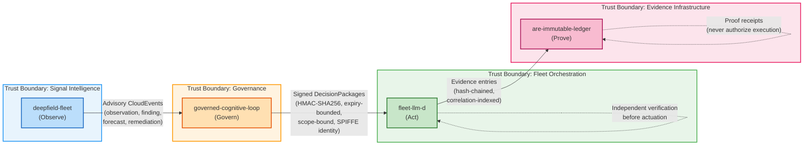
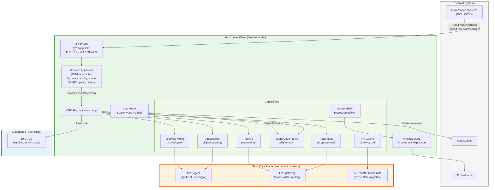
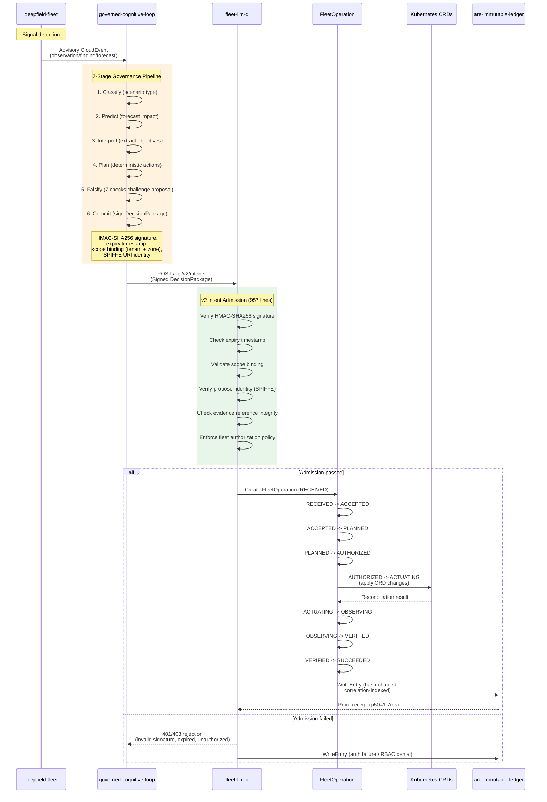
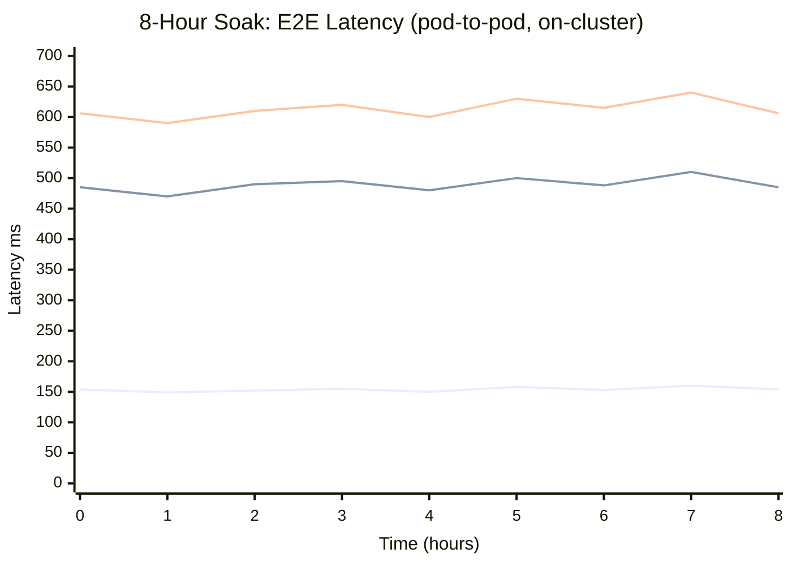
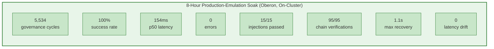
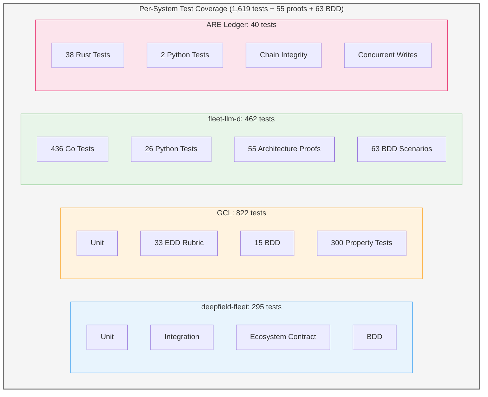
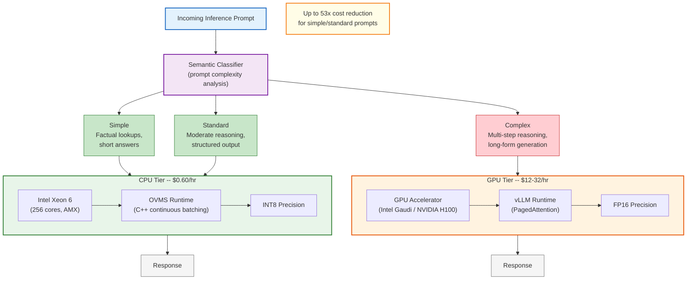
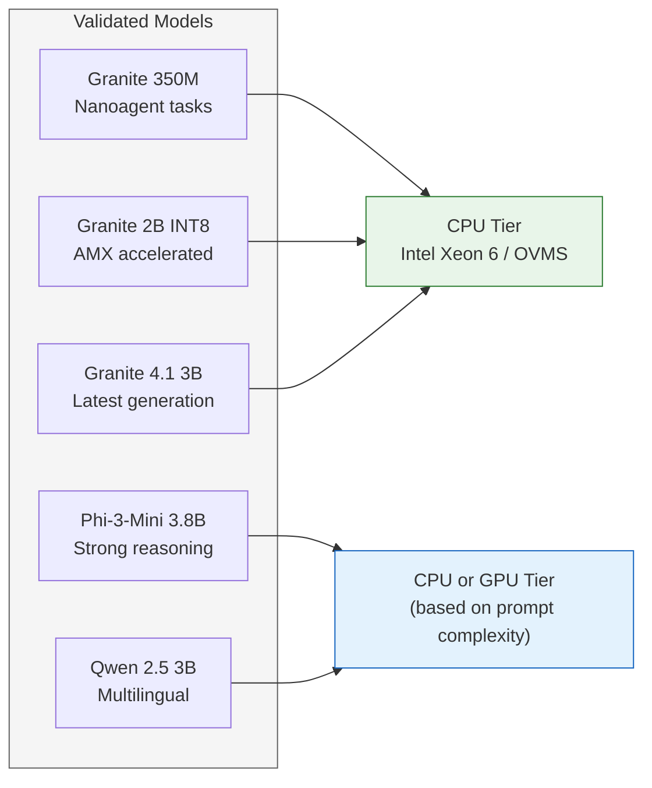

# fleet-llm-d Whitepaper Diagrams

Mermaid diagrams for the fleet-llm-d governed AI inference fleet whitepaper.

---

## 1. Platform Architecture -- 4-System Ecosystem Pipeline

The observe-govern-act-prove pipeline with trust boundaries between each system.



**Key invariants:**
- deepfield-fleet never contacts fleet-llm-d directly
- GCL cannot actuate infrastructure
- The ledger cannot authorize operations
- fleet-llm-d independently verifies, authorizes, and decides

---

## 2. fleet-llm-d Internal Architecture

Go control plane and Rust data plane with CRD reconciliation, intent admission, and inference proxy.



---

## 3. Decision Pipeline Event Flow -- Single Governance Cycle

Sequence from deepfield observation through ledger evidence write.



---

## 4. 17-Phase Operation Lifecycle

State diagram for FleetOperation phases from RECEIVED through completion or failure.

```mermaid
stateDiagram-v2
    [*] --> RECEIVED: Intent admitted

    RECEIVED --> ACCEPTED: Validation passed
    RECEIVED --> REJECTED: Validation failed

    ACCEPTED --> PLANNED: Placement/routing computed
    ACCEPTED --> FAILED_PLANNING: No feasible plan

    PLANNED --> AUTHORIZED: Authorization checks passed
    PLANNED --> UNAUTHORIZED: Policy denied

    AUTHORIZED --> ACTUATING: Begin CRD changes
    AUTHORIZED --> AUTHORIZATION_REVOKED: Authorization expired

    ACTUATING --> OBSERVING: Changes applied
    ACTUATING --> ACTUATION_FAILED: Apply error

    OBSERVING --> VERIFIED: Observed matches desired
    OBSERVING --> OBSERVATION_TIMEOUT: Deadline exceeded
    OBSERVING --> DRIFT_DETECTED: State divergence

    VERIFIED --> SUCCEEDED: All gates passed
    VERIFIED --> SLO_BREACH: SLO check failed

    SUCCEEDED --> [*]

    REJECTED --> FAILED
    FAILED_PLANNING --> FAILED
    UNAUTHORIZED --> FAILED
    AUTHORIZATION_REVOKED --> FAILED
    ACTUATION_FAILED --> FAILED
    OBSERVATION_TIMEOUT --> FAILED
    DRIFT_DETECTED --> FAILED
    SLO_BREACH --> FAILED

    FAILED --> [*]

    state FAILED {
        direction LR
        note left of FAILED
            Records:
            - Failure reason
            - Phase at failure
            - Full evidence chain
        end note
    }

    note right of RECEIVED
        Each phase transition
        is recorded to the
        evidence chain
    end note

    note right of SUCCEEDED
        Evidence written to
        ARE immutable ledger
    end note
```

**Primary path:** RECEIVED -> ACCEPTED -> PLANNED -> AUTHORIZED -> ACTUATING -> OBSERVING -> VERIFIED -> SUCCEEDED

**Failure branches:** Each phase can fail independently, recording the failure reason, phase, and full evidence chain.

---

## 5. 8-Hour Soak Latency Profile

Representation of the on-cluster soak latency behavior over 8 hours with degradation injections.



**Soak metrics summary:**



**Degradation injection profile (15/15 passed):**

```mermaid
gantt
    title Degradation Injections Over 8-Hour Soak
    dateFormat HH:mm
    axisFormat %H:%M

    section Burst-50
    Burst injection 1 (0 errors)          :b1, 01:00, 2m
    Burst injection 2 (0 errors)          :b2, 03:00, 2m
    Burst injection 3 (0 errors)          :b3, 05:00, 2m
    Burst injection 4 (0 errors)          :b4, 07:00, 2m

    section Invalid Intent
    Invalid submission 1 (401 reject)     :i1, 01:30, 1m
    Invalid submission 2 (401 reject)     :i2, 03:30, 1m
    Invalid submission 3 (401 reject)     :i3, 05:30, 1m
    Invalid submission 4 (401 reject)     :i4, 07:30, 1m

    section Upstream Reset
    Governance reset 1 (~1s recovery)     :r1, 02:00, 2m
    Governance reset 2 (~1s recovery)     :r2, 04:00, 2m
    Governance reset 3 (~1s recovery)     :r3, 06:00, 2m
    Governance reset 4 (~1s recovery)     :r4, 07:45, 2m

    section Expired Event
    Expired event 1 (403 reject)          :e1, 02:30, 1m
    Expired event 2 (403 reject)          :e2, 04:30, 1m
    Expired event 3 (403 reject)          :e3, 06:30, 1m
```



---

## 6. Test Coverage Matrix

Per-system test counts and ecosystem test phases.



**Ecosystem stress test phases (Oberon cluster, 42/48 passed):**

```mermaid
graph LR
    P1["Phase 1<br/>Smoke<br/>5/6"] --> P2["Phase 2<br/>Performance<br/>1/2"]
    P2 --> P3["Phase 3<br/>Pressure<br/>7/7"]
    P3 --> P4["Phase 4<br/>Edge Cases<br/>7/9"]
    P4 --> P5["Phase 5<br/>Degradation<br/>10/10"]
    P5 --> P6["Phase 6<br/>Soak<br/>6/6"]
    P6 --> P7["Phase 7<br/>Pen Testing<br/>5/5"]
    P7 --> P8["Phase 8<br/>Chaos<br/>1/3"]

    style P1 fill:#fff9c4,stroke:#F9A825,stroke-width:2px
    style P2 fill:#fff9c4,stroke:#F9A825,stroke-width:2px
    style P3 fill:#c8e6c9,stroke:#2E7D32,stroke-width:2px
    style P4 fill:#fff9c4,stroke:#F9A825,stroke-width:2px
    style P5 fill:#c8e6c9,stroke:#2E7D32,stroke-width:2px
    style P6 fill:#c8e6c9,stroke:#2E7D32,stroke-width:2px
    style P7 fill:#c8e6c9,stroke:#2E7D32,stroke-width:2px
    style P8 fill:#ffcdd2,stroke:#C62828,stroke-width:2px
```



Legend: Green = all passed, Yellow = partial pass, Red = majority failed (single-pod ceiling)

---

## 7. Heterogeneous Inference Routing

Prompt classification and routing to cost-appropriate hardware tiers.



**Benchmarked models on the heterogeneous pipeline:**


